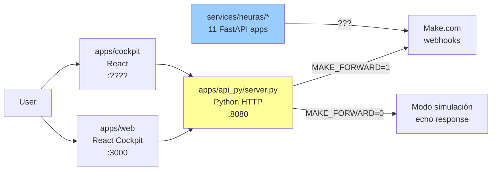

# ECONEURA - Arquitectura: Documentación vs Realidad

Este documento clarifica las diferencias entre la arquitectura documentada en el README (estado objetivo) y la implementación actual en el repositorio.

## Resumen Ejecutivo

**El README describe el estado OBJETIVO (100% GA)**, mientras que el repositorio contiene una **implementación parcial en evolución**. Esto es intencional pero puede confundir a agentes de IA o nuevos desarrolladores.

---

## Discrepancias Principales

### 1. API Backend

**README dice:**
```mermaid
Cockpit --> API[apps/api (proxy IA)]
```

**Realidad actual:**
- ✅ `apps/api_py/server.py` - Python proxy simple (puerto 8080)
- ❌ `apps/api/src/` - NO existe (solo Dockerfile vacío)
- ✅ `services/neuras/` - 11 microservicios FastAPI independientes

**Arquitectura real:**
```
apps/web (React) -----> apps/api_py/server.py (Python, puerto 8080)
                              |
                              v
                        Make.com (forward con MAKE_FORWARD=1)

apps/cockpit (React) ----> (mismo flujo)

services/neuras/* -------> Microservicios independientes
```

### 2. Configuración de Agentes

**README/copilot-instructions.md dicen:**
- "60 agentes generados por `scripts/ensure-sixty.ts`"
- "Enrutado en `packages/config/agent-routing.json`"

**Realidad actual:**
- ❌ `packages/config/` NO existe
- ✅ `packages/configs/` SÍ existe (note la 's')
- ❌ `agent-routing.json` NO se encuentra en el repo
- ✅ `apps/api_py/server.py` hardcodea 10 rutas: `neura-1` a `neura-10`
- ✅ `services/neuras/` contiene 11 directorios de servicio

```python
# De apps/api_py/server.py línea 4:
ROUTES=[f"neura-{i}" for i in range(1,11)]  # Solo 10 agentes, no 60
```

### 3. Coverage Thresholds

**README dice:**
```
Coverage: Statements ≥ 90%, Functions ≥ 80%
```

**Realidad en vitest.config.ts:**
```typescript
thresholds: {
  lines: 50,
  functions: 75,
  branches: 45,
  statements: 50,
}
```

**Status:** Thresholds temporalmente relajados con comentario explícito para lograr CI verde.

### 4. Aplicaciones Frontend

**README menciona:**
- `apps/web (React)` - Cockpit principal

**Realidad:**
- ✅ `apps/web/` - Cockpit web (puerto 3000)
- ✅ `apps/cockpit/` - Segundo cockpit (propósito sin documentar)

**Pregunta sin respuesta:** ¿Por qué hay dos cockpits? ¿Cuál es la diferencia?

### 5. Base de Datos y RLS

**README describe:**
- Postgres con Row Level Security (RLS)
- Esquemas en `packages/db/src/schema.ts`

**Realidad:**
- ❌ NO hay evidencia de esquemas de BD en el repo
- ❌ NO hay configuración de Postgres en docker-compose
- ⚠️  Los servicios FastAPI no tienen configuración de BD visible

---

## Servicios que SÍ Existen

### Python Services (FastAPI)

```
services/
├── neuras/
│   ├── analytics/app.py
│   ├── cdo/app.py
│   ├── cfo/app.py
│   ├── chro/app.py
│   ├── ciso/app.py
│   ├── cmo/app.py
│   ├── cto/app.py
│   ├── legal/app.py
│   ├── reception/app.py
│   ├── research/app.py
│   └── support/app.py
├── make_adapter/app.py
├── middleware/
│   ├── cors.py
│   └── finops_guard.py
└── controller/ (por confirmar contenido)
```

### Frontend Apps

```
apps/
├── web/          # Cockpit principal React+Vite (puerto 3000)
├── cockpit/      # Segundo cockpit (propósito TBD)
└── api_py/       # Proxy Python simple (puerto 8080)
```

### Packages

```
packages/
├── shared/       # Utilidades compartidas (Winston, OTLP, etc.)
└── configs/      # Configuraciones base (NO "config" singular)
```

---

## Arquitectura REAL Simplificada



**Notas:**
1. **Proxy simple:** `apps/api_py/server.py` es ~65 líneas de Python puro (stdlib)
2. **Sin BD actual:** No hay conexión visible a Postgres en el código
3. **Make.com como destino:** El forwarding va a Make.com, no a servicios internos
4. **Servicios neuras:** Existen pero su integración no está clara

---

## Recomendaciones para Agentes de IA

### ✅ CONFIAR en esto:
- Estructura de monorepo pnpm
- Comandos de desarrollo (`pnpm -C apps/web dev`)
- Estándares TypeScript/ESLint
- Tests con Vitest
- Thresholds actuales (50/75, no 90/80)

### ⚠️  VERIFICAR antes de usar:
- Cualquier referencia a `packages/config` (debe ser `packages/configs`)
- Cualquier mención de 60 agentes (actualmente hay 10 rutas hardcoded)
- Referencias a `apps/api` con código TypeScript (solo existe Python)
- Configuración de base de datos
- Integración entre `services/neuras` y el resto del sistema

### ❌ NO ASUMIR:
- Que existe `agent-routing.json` generado
- Que `scripts/ensure-sixty.ts` está implementado
- Que hay Postgres configurado localmente
- Que existe observabilidad OTLP funcionando (solo código stub)

---

## Comandos de Validación

Ejecuta esto para verificar el estado actual:

```bash
# 1. Verificar estructura real
ls -la apps/
ls -la packages/
ls -la services/neuras/

# 2. Buscar archivos de configuración de agentes
find . -name "*agent*.json" -o -name "*routing*.json"

# 3. Ver thresholds reales de coverage
grep -A 10 "thresholds" vitest.config.ts

# 4. Verificar qué servicios pueden arrancarse
find services -name "app.py" -o -name "server.py"
find apps -name "server.py" -o -name "package.json"
```

---

## Conclusión

Este no es un problema de "código roto", sino de **expectativas vs realidad**:

- **README.md** = Visión del producto final (marketing/roadmap)
- **Código actual** = MVP funcional con proxy simple y servicios en desarrollo

**Para agentes de IA:** Usa este documento como fuente de verdad sobre la implementación ACTUAL. Usa el README para entender la VISIÓN pero no asumas que todo está implementado.

---

**Última actualización:** 2025-01-XX  
**Fuente de verdad del código:** Rama `main`, commit `620906b` y posteriores
