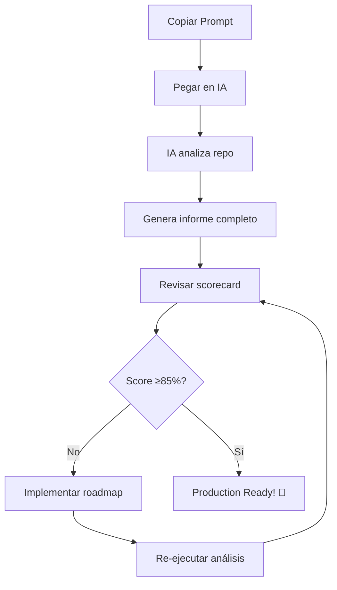

# 📊 GUÍA RÁPIDA: Análisis Exhaustivo ECONEURA

## 🎯 ¿Qué es esto?

Un **prompt especializado** para que cualquier IA (ChatGPT, Claude, Gemini, etc.) analice exhaustivamente el monorepo ECONEURA y te diga:

- ✅ **Estado actual** de cada área (% de completitud 0-100%)
- 🎯 **Objetivos claros** para alcanzar el 100% en todas las áreas
- 📋 **Roadmap detallado** con pasos específicos y tiempos estimados
- 🔴 **Prioridades** por impacto y urgencia
- ⚡ **Quick wins** (acciones rápidas de alto impacto)

---

## 📁 Archivos Importantes

| Archivo | Propósito |
|---------|-----------|
| **`PROMPT_ANALISIS_EXHAUSTIVO.md`** | Prompt completo con instrucciones detalladas para el análisis |
| **`MEGAPROMPT.md`** | Contexto completo del proyecto para trabajar con IAs |
| **`ARCHITECTURE_REALITY.md`** | Estado REAL del código (vs visión en README.md) |

---

## 🚀 Cómo Usarlo (3 pasos)

### Paso 1: Abre el prompt
```bash
# En tu terminal local
cd "C:\Users\Usuario\OneDrive\Documents\GitHub\ECONEURA-PUNTO"
cat docs/PROMPT_ANALISIS_EXHAUSTIVO.md
```

O desde GitHub:
```
https://github.com/ECONEURA/ECONEURA./blob/main/docs/PROMPT_ANALISIS_EXHAUSTIVO.md
```

### Paso 2: Copia el prompt completo
Busca la sección **"🤖 PROMPT COMPLETO PARA COPIAR/PEGAR"** en el documento y copia todo el contenido.

### Paso 3: Pégalo en tu IA favorita
- ChatGPT (GPT-4)
- Claude (Anthropic)
- Gemini (Google)
- Copilot Chat
- Cualquier otro LLM

---

## 📊 10 Áreas Evaluadas

El análisis cubre estas áreas críticas:

| # | Área | Qué se evalúa |
|---|------|---------------|
| 1️⃣ | **Arquitectura y Estructura** | Estructura de carpetas, configuración monorepo, documentación |
| 2️⃣ | **Frontend** | apps/web, apps/cockpit: código, tests, performance, accesibilidad |
| 3️⃣ | **Backend** | apps/api_py, services/neuras: endpoints, microservicios, observabilidad |
| 4️⃣ | **Código Compartido** | packages/shared, packages/configs, gestión de dependencias |
| 5️⃣ | **Testing y Calidad** | Coverage, linting, type safety, tests automatizados |
| 6️⃣ | **CI/CD y DevOps** | Workflows, Docker, Dev Containers, scripts de automatización |
| 7️⃣ | **Seguridad** | Auditoría, secrets, OWASP Top 10, auth/authz |
| 8️⃣ | **Documentación** | README, docs técnicos, comentarios, onboarding |
| 9️⃣ | **Performance** | Lighthouse, latencia backend, optimización DB |
| 🔟 | **Infraestructura** | Ambientes, monitoreo, escalabilidad, disaster recovery |

---

## 📈 Ejemplo de Output Esperado

```markdown
# ANÁLISIS EXHAUSTIVO ECONEURA - 2025-10-08

## 📈 SCORE GLOBAL: 67% (Promedio ponderado)

### Top 3 Áreas Mejor Evaluadas:
1. Arquitectura y Estructura: 85% ✅
2. Frontend (apps/web): 75% ✅
3. CI/CD y DevOps: 70% ✅

### Top 3 Áreas Críticas:
1. Seguridad: 35% 🔴
2. Performance: 40% 🔴
3. Testing y Calidad: 50% 🔴

### Deuda Técnica Total: 45 días/persona

---

## 📋 DESGLOSE POR ÁREA

### 1️⃣ ARQUITECTURA Y ESTRUCTURA: 85%

**Componentes Evaluados:**
- ✅ Estructura de directorios: 100%
- ✅ Configuración monorepo: 90%
- 🟡 Documentación arquitectónica: 70% - Faltan diagramas C4
- ❌ ADRs documentados: 0% - No existe carpeta docs/decisions/

**Evidencia Técnica:**
- Archivos revisados: pnpm-workspace.yaml, package.json, tree output
- Comandos ejecutados: tree -L 3, pnpm list -r
- Métricas: 15 packages, 3 apps, 11 services

**Problemas Identificados:**
1. No existen Architecture Decision Records (ADRs)
2. Diagramas arquitectónicos desactualizados

**Roadmap al 100%:**
1. [ ] Crear carpeta docs/decisions/ y documentar decisiones - 2 días
2. [ ] Actualizar diagramas con herramienta C4 o Mermaid - 3 días
3. [ ] Revisar y actualizar ARCHITECTURE_REALITY.md - 1 día

**Prioridad:** 🟡 MEDIA
**Impacto:** 📊 MEDIO

[... continúa para las otras 9 áreas ...]

---

## 🎯 ROADMAP PRIORIZADO AL 100%

### Sprint 1 (Semana 1-2): Fundamentos Críticos
- [ ] Subir coverage de tests a ≥80% (actualmente 50%)
- [ ] Implementar rate limiting en API proxy
- [ ] Configurar Sentry para error tracking

### Sprint 2 (Semana 3-4): Seguridad
- [ ] Migrar secrets a variables de entorno
- [ ] Implementar JWT refresh tokens
- [ ] Ejecutar auditoría OWASP

[... continúa con más sprints ...]
```

---

## 🎯 Criterios de 100% por Área

### ✅ CHECKLIST MASTER (100 items total)

Cada área tiene **10 criterios** que deben cumplirse para alcanzar el 100%:

#### Ejemplo: Frontend (10/10)
- [ ] TypeScript strict, 0 `any` injustificados
- [ ] ESLint pasa con --max-warnings 0
- [ ] Coverage ≥80% (statements, functions, branches)
- [ ] Lighthouse ≥90 en todas las métricas
- [ ] Bundle size <500KB gzipped
- [ ] Componentes <200 líneas
- [ ] Storybook con 100% de componentes
- [ ] Tests E2E para user journeys
- [ ] Accesibilidad WCAG 2.1 AA
- [ ] Lazy loading y code splitting

*Ver checklist completo en `PROMPT_ANALISIS_EXHAUSTIVO.md`*

---

## 💡 Quick Wins (Bajo Esfuerzo, Alto Impacto)

La IA identificará acciones como estas:

1. ✅ **Agregar badges de CI al README** - 15 minutos
   ```markdown
   
   ```

2. ✅ **Configurar Prettier con pre-commit hook** - 30 minutos
   ```bash
   pnpm add -D -w prettier husky lint-staged
   npx husky install
   ```

3. ✅ **Agregar health check endpoint con dependencias** - 1 hora
   ```python
   # apps/api_py/server.py
   @app.get("/api/health")
   async def health():
       return {
           "status": "ok",
           "dependencies": {
               "make_webhook": check_make_connection(),
               "services": check_neuras_services()
           }
       }
   ```

---

## 📊 Scorecard Visual Esperado

```
╔══════════════════════════════════════════════════════════════╗
║          ECONEURA MONOREPO - SCORECARD COMPLETO              ║
╚══════════════════════════════════════════════════════════════╝

┌────────────────────────────────────────────────────────────┐
│ SCORE GLOBAL: 67% / 100%                                    │
│ Estado: 🟡 EN PROGRESO (Production Ready ≥ 85%)            │
│ Deuda Técnica: 45 días/persona                             │
└────────────────────────────────────────────────────────────┘

┌────────────────────────┬─────────┬──────────┬──────────────┐
│ Área                   │ Actual  │ Objetivo │ Prioridad    │
├────────────────────────┼─────────┼──────────┼──────────────┤
│ 1. Arquitectura        │  85%    │ 100%     │ 🟡 MEDIA     │
│ 2. Frontend            │  75%    │ 100%     │ 🟡 MEDIA     │
│ 3. Backend             │  60%    │ 100%     │ 🔴 ALTA      │
│ 4. Código Compartido   │  70%    │ 100%     │ 🟢 BAJA      │
│ 5. Testing             │  50%    │ 100%     │ 🔴 ALTA      │
│ 6. CI/CD               │  70%    │ 100%     │ 🟡 MEDIA     │
│ 7. Seguridad           │  35%    │ 100%     │ 🔴 CRÍTICA   │
│ 8. Documentación       │  80%    │ 100%     │ 🟢 BAJA      │
│ 9. Performance         │  40%    │ 100%     │ 🔴 ALTA      │
│ 10. Infraestructura    │  45%    │ 100%     │ 🔴 ALTA      │
└────────────────────────┴─────────┴──────────┴──────────────┘

Top 3 Fortalezas:
  1. ✅ Arquitectura (85%) - Monorepo bien estructurado
  2. ✅ Documentación (80%) - MEGAPROMPT y docs completos
  3. ✅ Frontend (75%) - React+TypeScript con buenas prácticas

Top 3 Debilidades:
  1. 🔴 Seguridad (35%) - Secrets hardcoded, sin auth robusta
  2. 🔴 Performance (40%) - Sin optimización, bundle grande
  3. 🔴 Infraestructura (45%) - Solo dev local, sin staging/prod

Próximo Hito: Alcanzar 85% global (Production Ready)
ETA al 100%: 8-10 semanas (con 2 devs a tiempo completo)
```

---

## 🔄 Flujo de Trabajo Recomendado



### Frecuencia Recomendada
- 🟢 **Semanal**: Durante fase de desarrollo intensivo
- 🟡 **Quincenal**: Durante fase de mantenimiento
- 🔵 **Mensual**: En fase estable

---

## 🛠️ Comandos Útiles del Prompt

El prompt ejecutará automáticamente estos comandos:

```bash
# Contexto inicial
cd "C:\Users\Usuario\OneDrive\Documents\GitHub\ECONEURA-PUNTO"
git remote -v
tree -L 3 -I 'node_modules|.git'

# Análisis de código
pnpm list -r --depth 0
find . -name "*.test.ts*" | wc -l
grep -r "TODO\|FIXME" apps/ packages/

# Quality checks
pnpm -w lint --max-warnings 0
pnpm -w typecheck
pnpm -w test:coverage

# Seguridad
pnpm audit --audit-level=high
grep -r "password\|token\|secret" apps/ packages/

# Performance
pnpm build
du -sh dist/
npx lighthouse http://localhost:3000

# Docker
docker-compose -f docker-compose.dev.yml config
find . -name "Dockerfile" | wc -l
```

---

## 📚 Recursos Relacionados

| Documento | Enlace | Propósito |
|-----------|--------|-----------|
| **Prompt Análisis** | [docs/PROMPT_ANALISIS_EXHAUSTIVO.md](./PROMPT_ANALISIS_EXHAUSTIVO.md) | Prompt completo para análisis |
| **Megaprompt** | [docs/MEGAPROMPT.md](./MEGAPROMPT.md) | Contexto para trabajar con IAs |
| **Arquitectura Real** | [docs/ARCHITECTURE_REALITY.md](./ARCHITECTURE_REALITY.md) | Estado actual del código |
| **README Principal** | [README.md](../README.md) | Visión 100% GA (objetivo) |
| **Setup** | [docs/setup.md](./setup.md) | Instrucciones de instalación |

---

## 🎓 Tips para Mejores Resultados

### ✅ Hacer:
- Ejecutar el prompt en un repo **actualizado** (git pull)
- Proporcionar **contexto adicional** si es necesario ("enfócate en seguridad")
- **Guardar el informe** generado con fecha (ej: `ANALISIS_2025-10-08.md`)
- **Ejecutar comandos** sugeridos para validar resultados
- **Compartir hallazgos** con el equipo

### ❌ Evitar:
- Ejecutar en repo con **cambios sin commitear** (genera ruido)
- Ignorar **advertencias críticas** (🔴 ALTA prioridad)
- Procrastinar **quick wins** (son rápidos!)
- No documentar **decisiones** tomadas post-análisis

---

## 🎯 Objetivos Finales

Al completar el roadmap generado por el análisis, deberías tener:

### ✅ Arquitectura (100%)
- Monorepo optimizado y bien documentado
- ADRs para decisiones importantes
- Diagramas C4 actualizados

### ✅ Frontend (100%)
- TypeScript strict sin `any`
- Coverage ≥80%
- Lighthouse ≥90 en todas las métricas
- Bundle <500KB gzipped

### ✅ Backend (100%)
- API completamente documentada (OpenAPI)
- 11 microservicios con tests ≥80%
- Observabilidad OTLP funcional
- Rate limiting y logging robusto

### ✅ Testing (100%)
- Coverage global ≥80%
- Tests E2E para user journeys críticos
- Tests de performance con k6
- CI bloqueando PRs con tests fallidos

### ✅ Seguridad (100%)
- 0 vulnerabilidades críticas/altas
- Secrets en variables de entorno
- OWASP Top 10 mitigado
- Auth JWT con refresh tokens

### ✅ CI/CD (100%)
- Pipeline completo (lint, test, build, deploy)
- Deployment automático a staging/prod
- Notificaciones de fallo
- Dev Container funcional

### ✅ Documentación (100%)
- README completo con badges
- Guía de contribución
- API documentada
- Onboarding para nuevos devs

### ✅ Performance (100%)
- Lighthouse ≥90
- Latencia p95 <500ms
- Throughput ≥1000 req/s
- Caching estratégico

### ✅ Infraestructura (100%)
- Staging y prod desplegados
- Monitoreo 24/7
- Alertas configuradas
- Disaster recovery plan

### ✅ Código Compartido (100%)
- Packages TypeScript bien tipados
- Sin dependencias circulares
- Tests unitarios completos
- Versionado semántico

---

## 🚀 Próximos Pasos

1. **Ahora mismo:**
   - [ ] Leer `PROMPT_ANALISIS_EXHAUSTIVO.md`
   - [ ] Copiar el prompt completo
   - [ ] Pegarlo en tu IA favorita

2. **Después del análisis:**
   - [ ] Revisar scorecard generado
   - [ ] Identificar top 3 prioridades
   - [ ] Implementar quick wins (1-2 horas)

3. **Esta semana:**
   - [ ] Ejecutar comandos de verificación
   - [ ] Comenzar roadmap Sprint 1
   - [ ] Documentar decisiones tomadas

4. **Este mes:**
   - [ ] Completar áreas críticas (🔴)
   - [ ] Re-ejecutar análisis
   - [ ] Validar score ≥85% (Production Ready)

---

## 💬 Preguntas Frecuentes

### ❓ ¿Puedo modificar el prompt?
✅ Sí! Puedes agregar instrucciones específicas como:
- "Enfócate más en seguridad"
- "Omite análisis de frontend, ya está completo"
- "Agrega análisis de accesibilidad (a11y) en detalle"

### ❓ ¿Qué IA es mejor para este análisis?
- **ChatGPT GPT-4**: Excelente para análisis detallados
- **Claude 3**: Muy bueno con contextos largos
- **Gemini**: Rápido y efectivo
- **GitHub Copilot**: Bien integrado con VS Code

### ❓ ¿Cuánto tarda el análisis?
- **Prompt execution**: 2-5 minutos (dependiendo de la IA)
- **Lectura del informe**: 10-15 minutos
- **Implementar quick wins**: 1-2 horas
- **Roadmap completo**: 8-10 semanas (2 devs full-time)

### ❓ ¿Debo ejecutar comandos manualmente?
🟡 **Recomendado pero no obligatorio**. La IA los ejecutará conceptualmente, pero validar localmente confirma los resultados.

### ❓ ¿Qué hago si el score es <50%?
🔴 **Prioriza fundamentos críticos**:
1. Seguridad (vulnerabilidades, secrets)
2. Testing (coverage mínimo 50%)
3. CI/CD (lint, typecheck en cada PR)
4. Documentación (README, setup)

---

## 🎉 Conclusión

Este prompt es tu **copiloto técnico** para llevar ECONEURA de:
- ❌ Estado actual (X%)
- ✅ Production Ready (100%)

**Siguiente paso:** [Copiar el prompt y ejecutar el análisis →](./PROMPT_ANALISIS_EXHAUSTIVO.md)

---

**Versión:** 1.0.0  
**Última actualización:** 2025-10-08  
**Mantenido por:** Equipo ECONEURA

---

## 📎 Enlaces Rápidos

- 📄 [Prompt Completo](./PROMPT_ANALISIS_EXHAUSTIVO.md)
- 🎯 [Megaprompt](./MEGAPROMPT.md)
- 🏗️ [Arquitectura Real](./ARCHITECTURE_REALITY.md)
- 🏠 [README Principal](../README.md)
- 💻 [Repositorio GitHub](https://github.com/ECONEURA/ECONEURA.)
