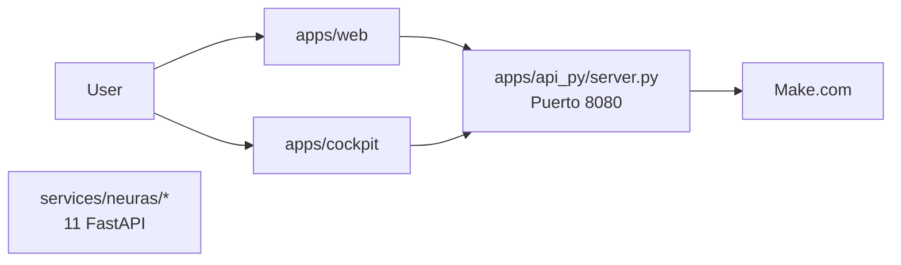

# Respuesta a: "¿Todo el graph es lo que hay en el repositorio de GitHub?"

## Respuesta Corta

**NO.** El diagrama de arquitectura en el README.md describe el estado OBJETIVO (100% GA), no la realidad actual del código.

## Diferencias Principales

### Lo que el README muestra:
```mermaid
flowchart LR
  User-->Cockpit[apps/web]
  Cockpit-->API[apps/api (proxy IA)]
  API-->DB[(Postgres + RLS)]
  API-->Make[Make.com]
```

### Lo que realmente existe:


## Qué SÍ Existe en el Código

✅ **Frontend**
- `apps/web/` - Cockpit React+Vite (puerto 3000)
- `apps/cockpit/` - Segundo cockpit React

✅ **Backend**
- `apps/api_py/server.py` - Proxy Python simple (~65 líneas, puerto 8080)
- 10 rutas hardcoded: `neura-1` a `neura-10`
- Forwarding a Make.com con `MAKE_FORWARD=1`

✅ **Microservicios**
- 11 servicios FastAPI en `services/neuras/`:
  - analytics, cdo, cfo, chro, ciso, cmo, cto, legal, reception, research, support

✅ **Packages**
- `packages/shared/` - Utilidades compartidas
- `packages/configs/` - Configuraciones (nota: plural)

## Qué NO Existe (pero está documentado)

❌ **Backend TypeScript**
- `apps/api/src/` no existe (solo Dockerfile vacío)

❌ **Base de Datos**
- No hay Postgres configurado
- No hay esquemas de BD
- No hay Row Level Security implementado

❌ **Configuración de Agentes**
- `packages/config/agent-routing.json` no existe en el repo
- Las rutas están hardcoded en `apps/api_py/server.py`
- No hay 60 agentes, solo 10 rutas definidas

❌ **Observabilidad Completa**
- Código de OpenTelemetry existe pero es stub/parcial
- No hay integración completa con App Insights/Grafana

## Documentos de Referencia

He creado tres documentos para clarificar esto:

1. **`docs/ARCHITECTURE_REALITY.md`** - Documento completo con todas las discrepancias
2. **`.github/copilot-instructions.md`** (actualizado) - Ahora refleja la realidad del código
3. **`scripts/validate-architecture.sh`** - Script para validar afirmaciones arquitectónicas

## Por Qué Esta Diferencia

Esto es **intencional y normal**:

- **README.md** = Documento de producto/roadmap para stakeholders
- **Código actual** = MVP funcional en desarrollo iterativo
- **copilot-instructions.md** = Guía práctica para desarrolladores/IA

## Recomendación para Agentes de IA

1. **SIEMPRE leer primero:** `docs/ARCHITECTURE_REALITY.md`
2. **Para arquitectura ACTUAL:** Explorar el código directamente
3. **Para arquitectura OBJETIVO:** Leer README.md
4. **Validar afirmaciones:** Ejecutar `./scripts/validate-architecture.sh`

## Ejemplo Práctico

### ❌ NO hagas esto:
```bash
# Esto fallará porque apps/api/src no existe
pnpm -C apps/api dev
```

### ✅ SÍ haz esto:
```bash
# Frontend
pnpm -C apps/web dev  # Puerto 3000

# Backend
cd apps/api_py && python server.py  # Puerto 8080
```

---

**Conclusión:** El "graph" del README es la **visión**, no la **realidad actual**. Usa `docs/ARCHITECTURE_REALITY.md` y el código fuente como fuente de verdad.
